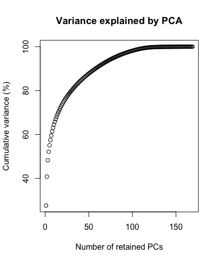
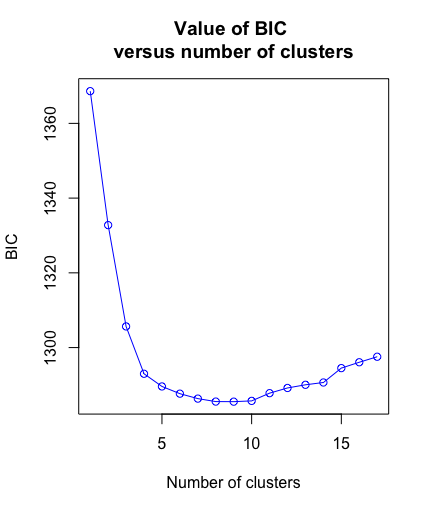
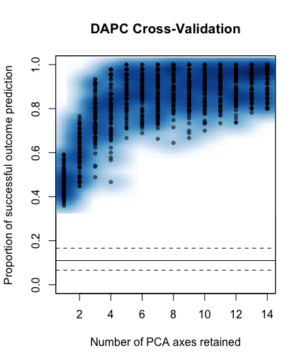
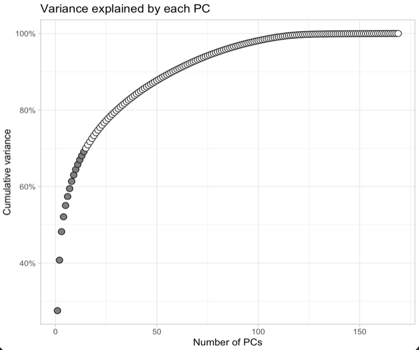
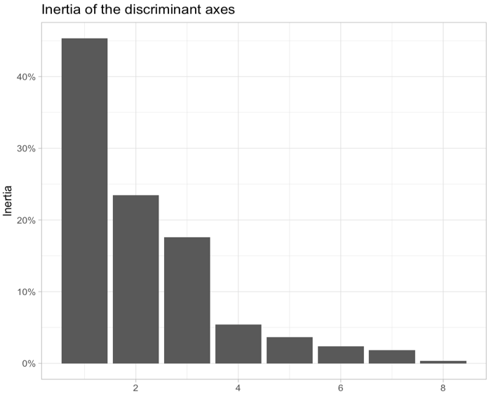

```{r setup, include=FALSE}
knitr::opts_chunk$set(echo = TRUE)

# Ensure working directory = location of this Rmd
knitr::opts_knit$set(
  root.dir = dirname(rstudioapi::getActiveDocumentContext()$path)
)
```

This notebook demonstrates how to perform a Population Genetics Analysis using R. The workflow presented here is commonly used to explore genetic structure among individuals using SNP markers. 
Steps covered in this tutorial: 

- Install and load the required packages 
- Import genotype data (VCF format)
- Convert the dataset into a genetic object usable in R
- Explore missing data in the dataset
- Perform a Principal Component Analysis (PCA)
- Identify genetic clusters among individuals
- Perform a Discriminant Analysis of Principal Components (DAPC)
- Visualize the results of the clustering analysis
- Build a Neighbor-Joining tree to visualize genetic relationships


# Load packages

First, we install and load the R packages required for the analysis. These packages provide tools to manipulate genetic data and perform population genetic analyses.

- vcfR: import and manipulate VCF genotype files
- adegenet: multivariate analysis of genetic markers (PCA, DAPC, clustering)
- poppr: tools for population genetics and clone analysis
- ape: phylogenetic analyses and tree visualization

```{r, message=FALSE}
packages <- c("vcfR", "adegenet", "poppr", "ape")

install_if_missing <- function(pkg){
  if(!require(pkg, character.only = TRUE)){
    install.packages(pkg, dependencies = TRUE)
    library(pkg, character.only = TRUE)
  }
}

invisible(lapply(packages, install_if_missing))

library(vcfR)
library(adegenet)
library(poppr)
library(ape)
```

------------------------------------------------------------------------

# Load VCF data

We now import the genotype dataset in VCF format (Variant Call Format). This format is widely used to store SNP data produced by sequencing pipelines.

```{r}
vcf <- read.vcfR("../data/final_data.vcf")
vcf
```

------------------------------------------------------------------------

# Convert VCF to a genind object

Most population genetics functions in adegenet require the data to be stored as a genind object. This object is a standard structure in R for genetic marker data.

```{r}
genind_obj <- vcfR2genind(vcf)
genind_obj
```

The genind object stores several important elements:

- the list of individuals
- the list of genetic loci
- the observed alleles at each locus 
- genotype information for each individual

This structure allows efficient manipulation and analysis of genetic data.

# Dataset visualization

Before performing analyses, it is important to evaluate the amount of missing data. Missing genotypes may bias downstream analyses such as PCA or clustering.

## Missing data per locus

Here we calculate the proportion of individuals successfully genotyped at each locus.

```{r}
missloc <- propTyped(genind_obj, by = "loc")

barplot(missloc, ylim = c(0,1), main = "Proportion of individuals genotyped per locus",
        xlab = "Locus", las = 2, cex.names = 0.1, col = "gray", border = NA)
```

This plot helps identify problematic loci with large amounts of missing data. Such loci are sometimes filtered out before performing downstream analyses.

## Missing data per individual

We can also examine missing data per individual.

```{r}
missind <- propTyped(genind_obj, by = "ind")

barplot(missind, ylim = c(0,1), main = "Proportion of markers per individual",
        xlab = "Individual", las = 2, cex.names = 0.2, col = "gray",
        border = NA)
```

Individuals with too many missing genotypes may need to be removed from the dataset.

# Quick view of genetic structure using PCA

A Principal Component Analysis (PCA) is often the first step used to explore genetic structure. PCA reduces the dimensionality of the dataset and summarizes the genetic variation into a few axes. However, PCA cannot handle missing data directly. Therefore, we first replace missing values using the mean allele frequency.

```{r}
genind_sG <- scaleGen(genind_obj, NA.method = "mean", scale = F)
```

## PCA anlysis and plotting

```{r}
pca <- dudi.pca(genind_sG, scannf = FALSE, scale = FALSE, nf = 4)
```

We plot the first two principal components.

```{r}
plot(pca$li[,1], pca$li[,2], xlab = "PC1", ylab = "PC2", pch = 19, col = "blue")
```

Each point represents an individual. Individuals that are genetically similar tend to cluster together.


# Identification of genetic clusters

For some analyses we need to assign individuals to genetic groups. If prior information about populations exists (sampling location, species, etc.), it can be imported into R. If not, we can infer clusters directly from the genotype data using the function `find.clusters` from the `adegenet` package. This method:

- Performs a PCA 
- Runs a K-means clustering algorithm 
- Tests different numbers of clusters

We will use the parameters `max.n.clust=20, n.pca = 200` to determine the number of populations that best explain the structure of our dataset. These parameters were determined previously using the command `groups <- find.clusters(genind_obj)`. When running this function interactively, R will ask you to specify the number of Principal Components (PCs) to retain for the analysis following the graphic 

.

and the maximum number of clusters to be used for the DAPC analysis, which can be inferred as number of clusters with the lowest BIC.



To ensure reproducibility across participants, we will set a random seed so that stochastic procedures produce the same results.

```{r }
set.seed(123)
# groups <- find.clusters(genind_obj)
groups <- find.clusters(genind_obj, n.pca = 200, max.n.clust = 20, n.clust = 9)

```

In this example, we specify 9 clusters based on the previous estimation.
We then assign the detected groups to the genind object.

```{r}
pop(genind_obj) <- groups$grp
```

# DAPC analysis

Now that individuals have been assigned to groups, we can perform a Discriminant Analysis of Principal Components (DAPC).
DAPC is a multivariate method specifically designed for genetic data. It works in two steps:

- PCA reduces the dimensionality of the genotype matrix
- Discriminant analysis maximizes the differences between predefined groups

## Choosing the number of principal components

Choosing too many or too few PCA components can affect the analysis. To determine the optimal number, we perform cross-validation using the function `xvalDapc` (in interest of time, you can skip this validation an go to the DAPC step). 
This function creates a plot sowing the results of each iteration: 



```{r, eval=F}
xval <- xvalDapc(genind_sG, groups$grp, n.pca.max = 15, result = "groupMean", 
                 center = F, scale = F, n.rep = 100)

xval$`Number of PCs Achieving Lowest MSE`
xval$DAPC$n.da
```

The outputs `xval$Number of PCs Achieving Lowest MSE`, and `xval$DAPC$n.da` indicate the optimal number of principal components (that minimizes prediction error) and discriminant axes to retain for the DAPC analysis, respectively, based on the cross-validation results.

In this example:
14 principal components and 8 discriminant axes were retained.

The first 14 PCs retained for the DAPC capture near 70% of  the total variance.

While most of the discrimination among groups is captured by the first three axes.

## Running the DAPC

```{r}
DAPC <- dapc(genind_obj, n.pca = 14, n.da = 8)
```

## Visualization of DAPC results

DAPC results can be visualized using scatterplots.
Each point corresponds to an individual, positioned according to the discriminant functions.

```{r}
myColors <- c("#7f3b08", "#b35806", "#e08214", "#fdb863", "#fee0b6", 
              "#b2abd2", "#8073ac", "#542788", "#2d004b")
scatter.dapc(DAPC, xax = 1, yax = 2, pch = 19, legend = T, posi.leg = "bottomleft", 
             scree.da = F, clab = 0, col = myColors)

axis(labels = T, pos = c(0,0), side = 1, cex = 0.5)
axis(labels = T, pos = c(0,0), side = 2, cex = 0.5)
```

For the next two discriminant axes:

```{r}
scatter.dapc(DAPC, xax = 3, yax = 4, pch = 19, legend = T, posi.leg = "bottomleft", 
             scree.da = F, clab = 0, col = myColors)
axis(labels = T, pos = c(0,0), side = 1, cex = 0.5)
axis(labels = T, pos = c(0,0), side = 2, cex = 0.5)
```

## Membership probabilities

DAPC also calculates the probability that each individual belongs to each cluster.
These probabilities can be visualized as a barplot.

```{r}
barplot(t(DAPC$posterior), las=2, width = 5, col = myColors, cex.names = .5,
        border = NA)
```

Alternatively, the function `compoplot.dapc` from `adegenet` provides a clearer visualization. 

```{r}
compoplot(DAPC, col.pal= myColors)
```

Each bar represents an individual, and colors represent the probability of belonging to each genetic cluster.

-----------------------------------------------

# Construction of a Neighbor-Joining tree

To visualize genetic relationships between individuals, we can build a Neighbor-Joining (NJ) tree.
This tree is based on Nei's genetic distance.
We use the function `aboot` function from the `poppr` package.

```{r warning=FALSE}
NJtree <- aboot(genind_obj, tree = "nj", missing = "mean", root = F, cutoff = 70,
                quiet = T, showtree = F)
```

This function performs:

-   SNP resampling
-   repeated tree reconstruction
-   bootstrap support estimation
Bootstrap values indicate the statistical support for each branch

## Plot the tree

Finally, we plot the tree, add the bootstraps, and color individuals according to the clusters identified by the DAPC.

```{r}
plot(NJtree, type="tidy", cex=0.4, no.margin=T, 
     tip.color = myColors[as.integer(DAPC$assign)])
nodelabels(NJtree$node.label, frame = "none", cex = 0.5)
```

Branches with high bootstrap values indicate stronger support for the inferred relationships.

